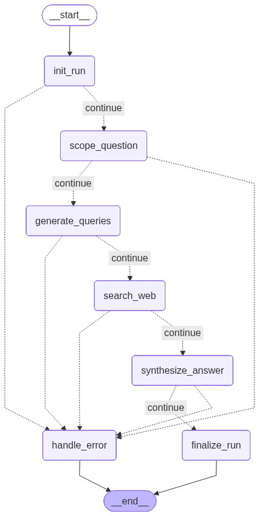

# 🔍 Focused Research Agent

An AI-powered research assistant built with **LangGraph**, **FastAPI**, and **Streamlit**. Given a question, the agent clarifies scope, plans targeted web searches, gathers sources, synthesizes a structured answer, and presents it through a clean web UI.

---

## 🎯 What This Project Does

The agent automates a structured research workflow — the same steps a human researcher would follow, but executed by an LLM-orchestrated pipeline:

```
User Question
    → Scope clarification (LLM)
    → Query planning (LLM)
    → Web search (Tavily)
    → Answer synthesis with citations (LLM)
    → Structured result returned to UI
```

---

## 🏗️ Architecture Overview

The project is built in three distinct layers, each with a single responsibility:

```
┌─────────────────────────────────────────────────┐
│  UI Layer (Streamlit)                           │
│  app.py · api_client.py · views.py              │
│  Thin client — calls FastAPI over HTTP          │
└─────────────────────┬───────────────────────────┘
                      │ HTTP
┌─────────────────────▼───────────────────────────┐
│  API Layer (FastAPI)                            │
│  Versioned routing · Dependency injection       │
│  Centralized exception handling                 │
└─────────────────────┬───────────────────────────┘
                      │ Function call
┌─────────────────────▼───────────────────────────┐
│  Application Layer                              │
│  Research use case · Input validation           │
│  State normalization                            │
└─────────────────────┬───────────────────────────┘
                      │ Graph invocation
┌─────────────────────▼───────────────────────────┐
│  Graph Layer (LangGraph)                        │
│  init_run → scope_question → generate_queries   │
│  → search_web → synthesize_answer → finalize    │
└─────────────────────┬───────────────────────────┘
                      │
        ┌─────────────┴─────────────┐
        ▼                           ▼
  LLM Provider                Search Provider
  (Groq / Llama)               (Tavily)
```

### Why this architecture?

Each layer has one job and knows nothing about the layers above it. The LangGraph nodes know nothing about HTTP. The FastAPI routers know nothing about LangGraph. The Streamlit UI knows nothing about the graph. This makes each layer independently testable and replaceable.

---

## 🧠 LangGraph Workflow

The graph below shows the compiled LangGraph workflow. Each box is a node — a discrete step in the research pipeline. The solid arrows are the happy path. The dashed arrows are the error routing paths.



### What each node does

| Node | Responsibility |
|---|---|
| `init_run` | Generates a unique run ID and validates that a question was provided |
| `scope_question` | Sends the question to the LLM to produce a focused scope, assumptions, and constraints |
| `generate_queries` | Sends the scope to the LLM to produce 3–6 targeted web search queries |
| `search_web` | Executes all queries through Tavily and collects deduplicated, normalized sources |
| `synthesize_answer` | Sends the top-ranked sources to the LLM to produce a concise answer with citations |
| `finalize_run` | Marks the run as `completed` if an answer exists and no errors occurred, otherwise `error` |
| `handle_error` | Terminal error node — logs all recorded errors and marks the run as `error` |

### How error routing works

Every node is followed by a conditional edge that calls `route_after_node(state)`. This function checks whether `state["errors"]` contains any entries. If errors exist, the graph routes to `handle_error`. If not, it continues to the next node.

This means errors are never silently swallowed and exceptions never bubble up through the graph. A node that encounters a problem records it in `state["errors"]` and returns — the routing logic handles the rest. The graph always terminates cleanly at `__end__`, regardless of which path was taken.

---

## 🛠️ Tech Stack

| Technology | Role | Why chosen |
|---|---|---|
| **LangGraph** | Workflow orchestration | Deterministic, reproducible agent behaviour with explicit state |
| **Groq + Llama** | LLM provider | Fast inference, free tier for development |
| **Tavily** | Web search | Purpose-built for AI agents, returns structured results |
| **FastAPI** | REST API backend | Modern Python API framework with built-in validation |
| **Pydantic** | Request/response validation | Shared validation logic between API and application layer |
| **Streamlit** | Web UI | Rapid UI development for AI applications |
| **httpx** | HTTP client | Modern Python HTTP client used in the UI layer |
| **uv** | Package management | Fast, modern Python package manager |
| **pytest** | Testing | Industry standard Python testing framework |
| **Ruff** | Linting and formatting | Fast, modern Python linter |
| **SonarCloud** | Code quality gate | Continuous inspection of code quality and coverage |

---

## 📁 Project Structure

```
focused-research-agent/
├── src/
│   └── focused_research_agent/
│       ├── api/                        # FastAPI transport layer
│       │   ├── routers/
│       │   │   ├── health.py           # GET /health
│       │   │   ├── research.py         # POST /api/v1/research
│       │   │   └── v1.py               # Versioned router grouping
│       │   ├── schemas/research/
│       │   │   └── research.py         # Request/response Pydantic models
│       │   ├── api_exception_handlers.py  # Centralized error handling
│       │   ├── app.py                  # FastAPI app factory
│       │   └── dependencies.py         # Dependency injection wiring
│       ├── application/                # Use-case / business logic layer
│       │   ├── exceptions.py           # ApplicationError (transport-neutral)
│       │   ├── question_validation.py  # Shared validation (API + app layer)
│       │   └── research_use_case.py    # Core research orchestration
│       ├── config/                     # Configuration layer
│       │   ├── api_config.py           # FastAPI settings dataclass
│       │   ├── llm_config.py           # LLM provider settings
│       │   ├── logger_config.py        # Rotating file logger
│       │   ├── search_config.py        # Search provider settings
│       │   └── ui_config.py            # Streamlit UI settings
│       ├── interfaces/                 # Abstract provider contracts
│       │   ├── llm_interface.py        # LLMProvider ABC
│       │   └── search_interface.py     # SearchProvider ABC + SearchResult
│       ├── nodes/                      # LangGraph node functions
│       │   ├── init_run.py
│       │   ├── scope_question.py
│       │   ├── generate_queries.py
│       │   ├── search_web.py
│       │   ├── synthesize_answer.py
│       │   ├── finalize_run.py
│       │   └── handle_error.py
│       ├── services/                   # External provider implementations
│       │   ├── llm_factory.py
│       │   ├── llm_provider_groq.py    # Groq implementation
│       │   ├── search_factory.py
│       │   └── search_provider_tavily.py  # Tavily implementation
│       ├── ui/                         # Streamlit UI transport layer
│       │   ├── api_client.py           # HTTP client (httpx, no Streamlit)
│       │   ├── app.py                  # Streamlit entrypoint
│       │   ├── exceptions.py           # UI-specific exceptions
│       │   └── views.py                # Rendering functions (no httpx)
│       ├── cli.py                      # CLI transport layer
│       ├── graph.py                    # LangGraph graph builder
│       └── state.py                    # ResearchState TypedDict
├── tests/                              # All tests live here, not in src/
│   ├── test_api_health.py
│   ├── test_api_research.py
│   ├── test_cli_helpers.py
│   ├── test_config_and_factories.py
│   ├── test_graph_error_paths.py
│   ├── test_nodes_smoke.py
│   ├── test_nodes_unit.py
│   ├── test_providers_unit.py
│   ├── test_research_use_case.py
│   └── test_ui_api_client.py
├── docs/
├── logs/
├── .env.example
├── pyproject.toml
└── README.md
```

---

## ⚙️ Setup and Installation

### Prerequisites

- Python 3.13
- [uv](https://docs.astral.sh/uv/) package manager
- Groq API key — [console.groq.com](https://console.groq.com)
- Tavily API key — [tavily.com](https://tavily.com)

### 1. Clone the repository

```bash
git clone https://github.com/tusharkhoche/focused-research-agent.git
cd focused-research-agent
```

### 2. Install dependencies

```bash
uv sync
```

### 3. Configure environment variables

```bash
cp .env.example .env
```

Edit `.env` and fill in your API keys:

```env
# LLM Settings
LLM_PROVIDER=groq
LLM_MODEL=llama-3.3-70b-versatile
LLM_TEMPERATURE=0.0
LLM_MAX_RETRIES=2
LLM_API_KEY=your_groq_api_key_here

# Search Settings
SEARCH_PROVIDER=tavily
SEARCH_API_KEY=your_tavily_api_key_here
SEARCH_MAX_RESULTS=5
SEARCH_DEPTH=basic

# API Settings
API_TITLE=Focused Research Agent API
API_VERSION=1.0.0
API_DEBUG=false

# UI Settings
UI_API_BASE_URL=http://localhost:8000
UI_REQUEST_TIMEOUT=120
```

---

## 🚀 Running the Project

The project has three ways to run — CLI, API only, or full stack (API + UI).

### Option 1 — CLI

```bash
uv run focused-research-agent "What are the latest advances in quantum computing?"
```

Or interactive mode:

```bash
uv run focused-research-agent
```

### Option 2 — FastAPI backend only

```bash
uv run uvicorn --factory focused_research_agent.api.app:create_app --reload
```

API docs available at: `http://localhost:8000/docs`

### Option 3 — Full stack (recommended)

Open two terminals:

```bash
# Terminal 1 — start the backend
uv run uvicorn --factory focused_research_agent.api.app:create_app --reload

# Terminal 2 — start the UI
uv run streamlit run src/focused_research_agent/ui/1_🔍_Research.py
```

UI available at: `http://localhost:8501`

---

## 🧪 Running Tests

```bash
# Run all tests
uv run pytest -v

# Run with coverage report
uv run pytest --cov=src/focused_research_agent --cov-report=term-missing -v

# Run a specific test file
uv run pytest tests/test_api_research.py -v
```

---

## 📊 API Reference

### Health Check

```
GET /health

Response 200:
{
    "status": "ok"
}
```

### Research Endpoint

```
POST /api/v1/research

Request:
{
    "question": "What are the latest advances in quantum computing?"
}

Response 200:
{
    "run_id": "abc-123",
    "question": "What are the latest advances in quantum computing?",
    "status": "completed",
    "scope": "Explain the latest advances in quantum computing...",
    "queries": ["recent quantum computing breakthroughs", ...],
    "sources": [{"title": "...", "url": "...", "snippet": "...", "score": 0.95}],
    "answer": "The latest advances include...",
    "citations": ["https://..."],
    "errors": []
}

Error responses follow a consistent shape:
{
    "status_code": 400,
    "error": "application_error",
    "detail": "Human readable message",
    "path": "/api/v1/research"
}
```

---

## 🎨 Key Design Decisions

**Function-based nodes, class-based providers**
LangGraph nodes are pure functions — they take state in and return partial state updates. Providers (Groq, Tavily) are classes because they hold client configuration and connection state that must persist across calls.

**State-based error routing over exceptions**
Nodes record errors in `state["errors"]` rather than raising exceptions. A conditional edge after each node checks for errors and routes to `handle_error`. This keeps the graph deterministic and makes error paths explicit in the graph diagram.

**Shared validation across transports**
`validate_and_clean_question` is used by both the Pydantic request schema (`AfterValidator`) and the application layer. It raises `ValueError` so Pydantic can use it directly. The application layer catches `ValueError` and re-raises as `ApplicationError` — one function, correct behaviour in both transport contexts.

**Streamlit as a thin client**
The Streamlit UI never imports LangGraph, FastAPI, or any research logic. It only calls the FastAPI backend over HTTP via `api_client.py`. This means the UI can be deployed independently and the backend can be tested without a browser.

**True factory startup**
`create_app()` is called at startup, not at import time. This allows proper dependency wiring and makes the app fully testable via `dependency_overrides`.

---

## 📈 Code Quality

| Metric | Value |
|---|---|
| Test coverage | 78% overall, 100% on new code |
| Tests | 67 passing |
| Duplications | 0.0% |
| Security hotspots | 0 |
| Sonar Quality Gate | ✅ Passing |

---

## 🗺️ Roadmap

- [x] Phase 1 — Core LangGraph workflow
- [x] Phase 1 — FastAPI backend with versioned routing
- [x] Phase 2A — Streamlit UI (single-turn research)
- [x] Phase 2B — UX polish (metrics, debug panel, dividers)
- [ ] Phase 3 — Conversation history with SQLite persistence
- [ ] Phase 4 — Full report generation mode
- [ ] Phase 5 — Mode-aware agent (quick answer vs full report)
- [ ] Phase 6 — Multimodal results (images from sources)

---

## 👤 Author

**Tushar** — transitioning from software testing to AI development.

Built this project to demonstrate production-grade AI system design with LangGraph, FastAPI, and modern Python engineering practices.

[LinkedIn](https://linkedin.com/in/your-profile) · [GitHub](https://github.com/tusharkhoche)